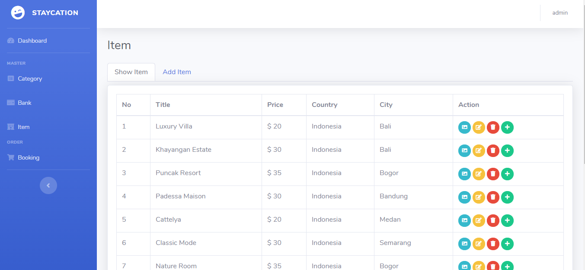

## CMS Staycation Apps

This project is still on very early development stage. If you want to use for production, use it with your own risk.
 More feature Coming Really Soon.

## Introduction

- Staycation is a hotel, villa, or apartment booking application for those who want to vacation with family or relatives. As well as recommending lodging with many facilities including games fun, a swimming pool and its location close to other attractions around it.

## Screenshots

## Features

| Menu     | Action                                                  |
| -------- | ------------------------------------------------------- |
| Category | Create Category                                         |
| Bank     | Create Bank Update Bank Delete Bank             |
| Item     | Create Item Update Item Delete Item             |
| Feature  | Create Feature Update Feature Delete Feature    |
| Activity | Create Activity Update Activity Delete Activity |

- CMS [https://api-admin-staycation.herokuapp.com/](https://api-admin-staycation.herokuapp.com/)

## Tech Stack

- Express Generator
- Bootstrap UI Component
- Jquery
- MongoDB
- Heroku

## Prerequisite

- Make sure You had been install NodeJs in your system https://nodejs.org/
- Then install Bootstrap as UI Component https://getbootstrap.com/
- Then install React HTML Parser https://www.npmjs.com/package/react-html-parser

## Support Me :)

- Star this repository :star:
- Hire Me https://www.linkedin.com/in/noorqidam

## Contact

- WA/TELEGRAM: +62 8577 1603 597
- email: noorqidam@gmail.com
